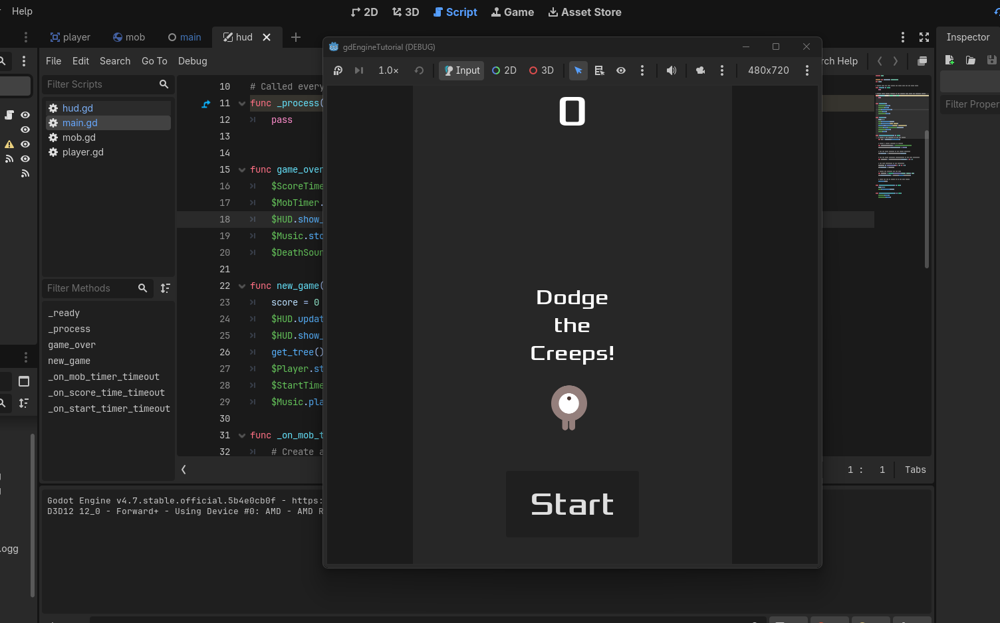
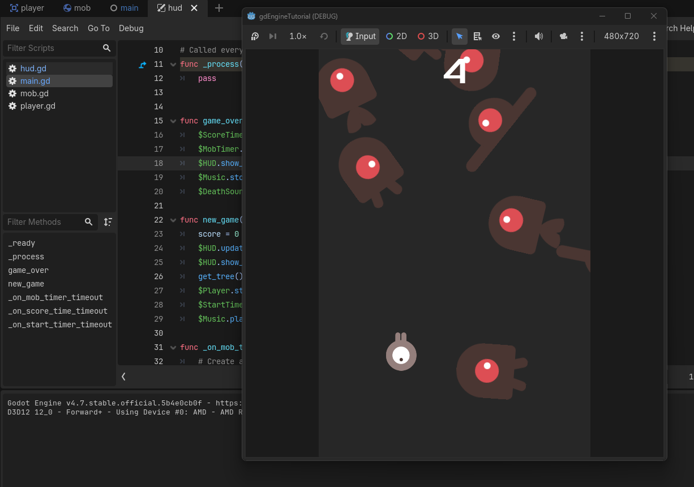
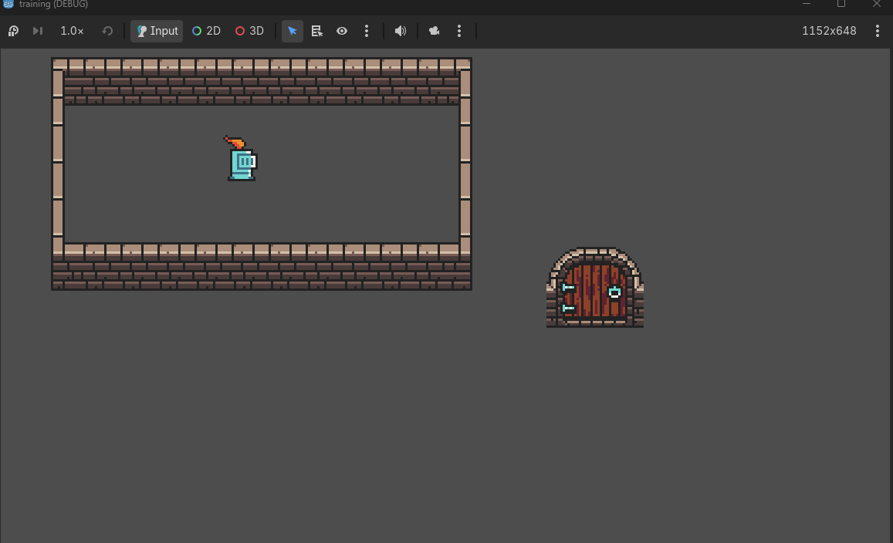

# I'm learning Godot?

Took a break from rust cause I had an itch to get back into game development

Its a very simple game I made following the gdEngine tutorial page

*Im preparing to make a game in the GMTK game jam* so this is practice!

**I am also trying to make a dungeon crawler**

