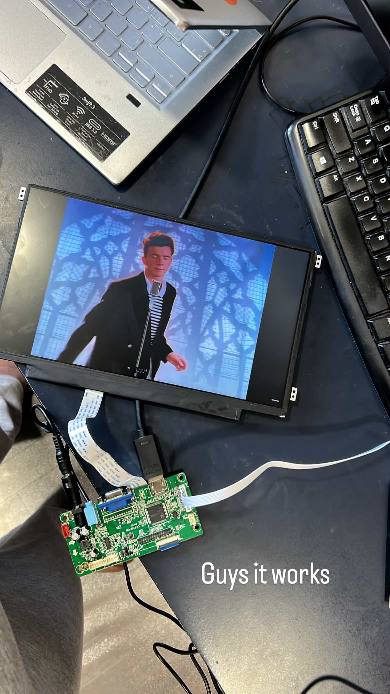

# I made my laptop screen into a monitor??

I have been playing around with hardware and I finally realized that the reason I have not been able to go anywhere with it is cause I'm afraid to order components online... Im not kidding!

So I made an AliExpress account and just started getting boards and stuff I actually needed to make my projects (its so cheap too!)\

**But how does this relate to my laptop screen becoming a monitor??**

Basically, I have a couple of old laptops lying around and wanted to use the screens for other projects as buying screens online is... *expensive*

so I was able to carefully take it out without damaging other components (hopefully... I haven't really checked)

I then bought an EDP controller for that specific screen model and hooked everything up (this was over the span of 2 weeks, mostly waiting for an aliexpres order)

I want to turn this LCD screen into a screen for a game console. I already have joysticks and buttons from a previous project I was working on and an old RPI with retroarch so hopefully I can make a cool looking game console!

